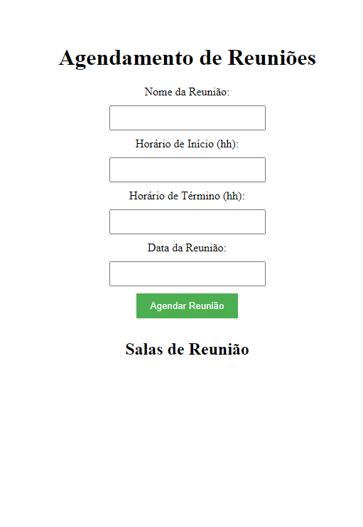
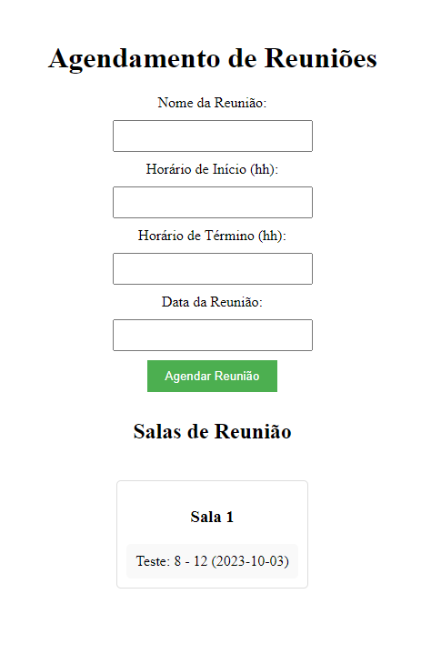
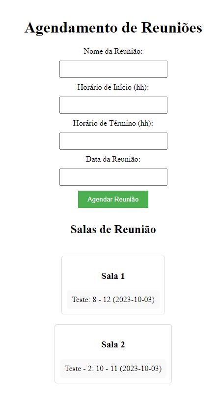
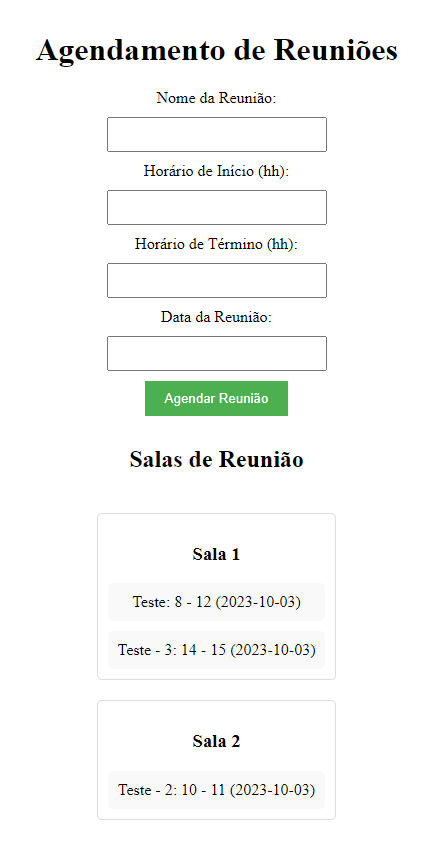

## Time Maker

Temas:
 - Greed


## Alunos
|Matrícula | Aluno |
| -- | -- |
| 17/0114139  |  Samuel Victor Castro Macêdo |
| 19/0033427  |  Pedro Henrique Caldeira de Moraes|

## Sobre 
O Time Maker oferece uma experiência completa de agendamento, permitindo que você reserve salas de reunião com facilidade e evite conflitos de horários. Além disso, nossa funcionalidade de criação dinâmica de salas garante que você nunca fique sem espaço para realizar suas discussões importantes.

Com uma interface de usuário amigável e recursos inteligentes, o Time Maker simplifica o processo de agendamento, permitindo que você se concentre no que é mais importante: o seu trabalho. Otimize o uso de suas salas de reunião e maximize a produtividade da sua equipe com o Time Maker.
## Screenshots









## Instalação 
**Linguagem**: Python<br>
**Framework**: Flask<br>

**Dependências**
- Python 3.9.0 ou superior
- Flask 3.0 ou superior
- instalar as bibliotecas necessárias.
  
**Execução**
- Clone o projeto (ou baixe):
  
  ```shell
  git clone https://github.com/projeto-de-algoritmos/Greed_Time_Maker
  && cd Greed_Time_Maker

  ```
- Instale o framework necessário:
    ``` 
    pip install flask 
    
    ```
 
 - Execute o arquivo principal ```app.py```:
  
    ```shell
    cd Scripts
    python3 app.py 
    ```


## Uso 
1. Insira os detalhes da reunião, incluindo o nome da reunião, a data, o horário de início e o horário de término nos campos correspondentes. 
2. Clique no botão "Agendar Reunião" para reservar uma sala de reunião com base nos detalhes fornecidos.
3. Selecione a sala de reunião desejada com base na disponibilidade e capacidade exibidas.
4. Para cancelar uma reunião agendada, clique no botão "Cancelar" ao lado da reunião listada.
5. Explore as salas de reunião disponíveis e observe as alterações na visualização gráfica do agendamento.
6. Aprecie a facilidade de agendamento proporcionada pelo Time Maker e otimize a organização das reuniões em seu local de trabalho.


## Apresentação
[Link Apresentação](https://youtu.be/txv05VCChdE)


